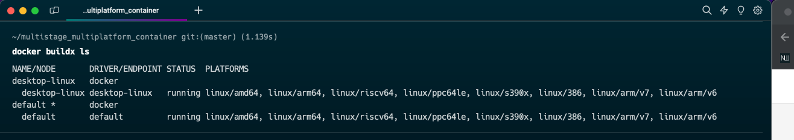
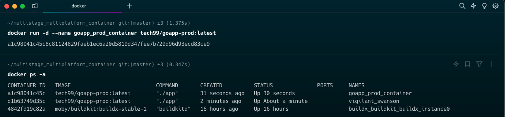
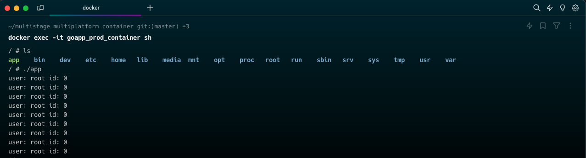

# Multistage Multiplatform Docker Images

## Create a custom docker image for a simple golang application.

```go
package main

import (
    "fmt"
    "time"
    "os/user"
)

func main () {
    user, err := user.Current()
    if err != nil {
        panic(err)
    }

    for {
        fmt.Println("user: " + user.Username + " id: " + user.Uid)
        time.Sleep(1 * time.Second)
    }
}
```

## let’s write a Dockerfile to package the golang application :

```shell
FROM ubuntu:latest
ARG DEBIAN_FRONTEND=noninteractive
RUN apt-get update && \
 apt-get -y upgrade && \
 apt-get install -y golang-go
COPY app.go .
RUN CGO_ENABLED=0 go build app.go
CMD ["./app"]

```

## Create a docker image and run a container from that image :

```
docker build -t goapp .
```


If we check the image size which helped us to build our application artifact :

```
docker images goapp
```


## Create a Multi Stage Dockerfile

We will divide our Dockerfile into two stages. One will be the build stage, which will help us to build our application and generate the artifact. And then we will only copy the artifact from the build stage to another stage and create a tiny production image.

```
# Dockerfile.prod
FROM ubuntu as builder
ARG DEBIAN_FRONTEND=noninteractive
RUN apt-get update && \
  apt-get -y upgrade && \
  apt-get install -y golang-go
COPY app.go .
RUN CGO_ENABLED=0 go build app.go

FROM alpine
COPY --from=builder /app .
CMD ["./app"]
```

Build the multi-staged `Dockerfile.prod`

```
docker build -t goapp .
```


If we check the image size which helped us to build our application artifact :

```
docker build -t goapp-prod -f Dockerfile.prod .
```


Now, build the image and check the image size :


**_As we can see image size has been reduced significantly._**

## Make it multiplatform compatible Images with buildx

- **_Builder instance:_** For using docker buildx, there should be a builder instance up and running and for creating a builder instance fire docker buildx create --use.

```
docker buildx create --use --name buildx_instance
```

- Once the builder instance is created and active, it can be used using `docker buildx build` command for building images.
- As well the status of the instance can be checked using docker `buildx ls` or `docker ps` command



- `docker buildx build` command can be used for building images, the intresting option while building the image is `--platform` flag. In this command we are creating a image which is compatible with ARM as well as AMD processors.
- The images won't be visible under `docker images` and these images will be in buildx cache only. Further `--push` flag can be used to directly push the images to dockerhub.

```
docker buildx build --platform linux/amd64,linux/arm64,linux/arm/v7 -t tech99/goapp-prod -f Dockerfile.prod --push .
```

- Here is how it will be visible on dockerhub:


## Run multistaged and multiplatform containers from image:-

```
docker run -d --name goapp_prod_container tech99/goapp-prod:latest

docker ps -a
```



## Open a shell inside the container & run the Go app

```
docker exec -it goapp_prod_container sh
```



- We can see that after building the application we have app artifact inside the container.
